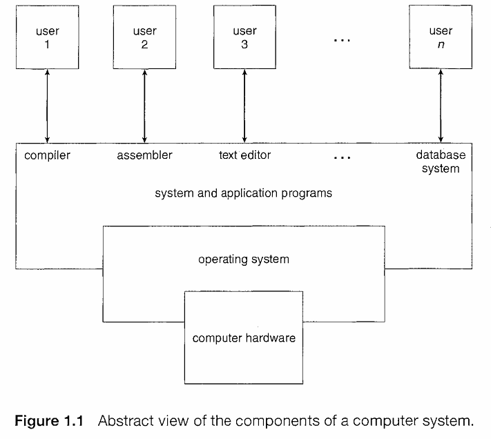

# **Module 1: What Does an Operating System Do?**

A computer system can be divided roughly into four main components:
1. **Hardware**
2. **Operating System**
3. **Application Programs**
4. **Users**

## **1. Hardware**
The hardware is the physical part of the computer system and includes:
- **Central Processing Unit (CPU)**: The brain of the system that performs computations.
- **Memory**: Stores data and instructions temporarily for the CPU.
- **Input/Output (I/O) Devices**: Hardware used for interacting with the system, such as keyboards, monitors, and network interfaces.

### **Role of Hardware:**
Hardware provides the basic resources required by the system to perform any task. It is responsible for the execution of operations at the most fundamental level.

---

## **2. Application Programs**
Application programs are software that uses hardware resources to solve user-specific problems. These programs enable the system to perform tasks ranging from simple calculations to complex simulations.

### **Role of Application Programs:**
- Define how hardware resources are utilized.
- Provide a user interface and functionality tailored to user needs.

---

## **3. Operating System**
The operating system (OS) is the intermediary between hardware and application programs. It acts as a **manager** for the hardware and software resources, controlling and coordinating their use.

### **Core Functions of the Operating System:**
1. **Resource Management**: Allocates hardware resources (e.g., CPU time, memory, I/O devices) to application programs.
2. **Process Management**: Manages processes (running programs) by scheduling them for execution and handling multitasking.
3. **Memory Management**: Ensures that each application gets enough memory while managing the memory resources efficiently.
4. **File System Management**: Controls the storage, retrieval, and organization of files on storage devices.
5. **Device Management**: Controls and coordinates the use of I/O devices.

### **Why Do Operating Systems Exist?**
Operating systems exist because they provide a convenient and efficient way to use hardware and run application programs. Without an OS, users would have to deal with the complexities of managing hardware directly, which would be impractical and error-prone.

---

## **4. Users**
The users interact with the system through application programs, using the operating system to facilitate the execution of their tasks. The operating system provides **user interfaces** (e.g., command-line, graphical user interfaces) that allow users to interact with hardware and software seamlessly.

---

## **Why Is an Operating System Necessary?**

- **Abstracts Complexity**: An OS hides the complex nature of hardware operations and provides an easier way for users and programs to interact with the system.
- **Resource Allocation**: It ensures that resources are used efficiently and fairly among different applications and users.
- **Makes System Usable**: Operating systems turn raw hardware into a usable system by managing resources and facilitating user interaction.

> **In short, the fundamental goal of computer systems is to execute user programs and make problem-solving easier. The OS plays a crucial role in making this possible by managing the hardware and providing an interface for user programs.**

---

## **Illustrative Diagram: The Components of a Computer System**

---

## **Key Takeaways:**
- **Hardware** provides the basic foundation.
- **Operating System** manages resources and coordinates their use.
- **Application Programs** solve specific user problems by utilizing system resources.
- **Users** interact with the system through programs facilitated by the OS.

---

### **Conclusion:**
An operating system makes it easier to use computer hardware by managing resources and providing the necessary interfaces for applications to function properly. It abstracts the complexities of hardware, making the entire system more efficient and user-friendly.

### For notebook of this module : [notebook](https://www.notion.so/minhducthlv/What-Operating-System-Do-1d1b0586681c80b6975ad31dffc42752?pvs=4)